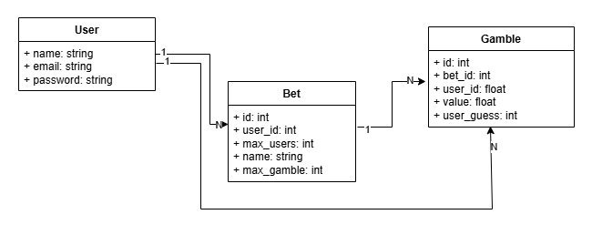
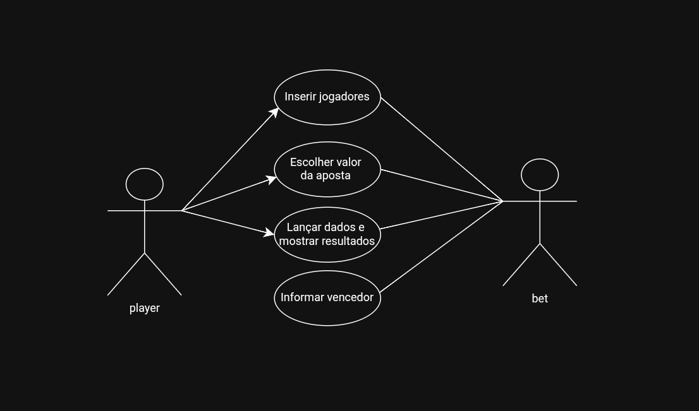

# JogodDados
## Levantamento de Requisitos

-Requisitos Funcionais

RF01 – Permitir inserir a quantidade de jogadores.

RF02 – Permitir cadastrar o nome de cada jogador.

RF03 – Permitir que cada jogador escolha um valor para apostar (entre 2 e 12).

RF04 – Realizar o lançamento de dois dados de forma aleatória.

RF05 – Calcular a soma dos valores das faces dos dois dados.

RF06 – Apresentar o resultado do lançamento dos dados.

RF07 – Verificar se algum jogador apostou o valor igual ao resultado.

RF08 – Informar o(s) jogador(es) vencedor(es) ou, se não houver, informar que o computador venceu.

-Requisitos Não Funcionais

RNF01 – O sistema deve ser desenvolvido em Java, utilizando Programação Orientada a Objetos (POO).

RNF02 – O sistema deve utilizar classes, atributos, métodos e objetos conforme os princípios da POO.

RNF03 – O sistema deve gerar resultados aleatórios ao lançar os dados.

-Regras de Negócio

RN01 – O número máximo de jogadores é 11.

RN02 – O valor da aposta deve estar entre 2 e 12.

RN03 – Jogadores podem apostar em valores iguais (dividindo o prêmio).

RN04 – Caso nenhum jogador acerte, o computador é declarado vencedor.

## Diagrama de classes

## Diagrama de Casos de uso

